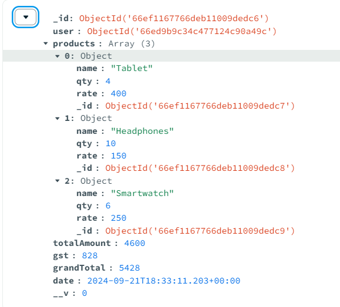
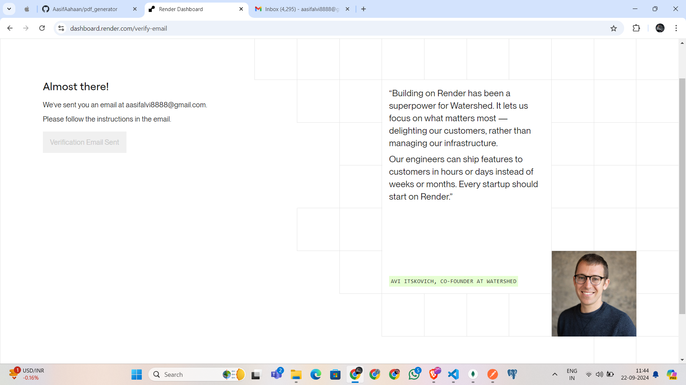
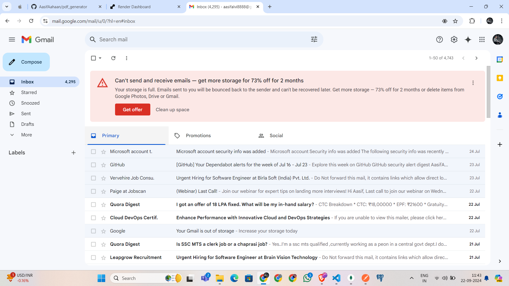

After cloning the project, follow these steps:

Run npm install to install the required dependencies.
In the .env file, add the database URL.
Run npm run dev to start the project in development mode.
Use npm run build to build the project for production.

1. The APIs for user registration and user login have been created, and a token is returned when logging in.
2. When we pass an array of products in the request body, a token is required; otherwise, the user will receive a response requesting the token.

example:- 
{
    "products": [
        {
            "name": "Camera",
            "qty": 3,
            "rate": 800
        },
        {
            "name": "Tripod",
            "qty": 4,
            "rate": 100
        },
        {
            "name": "Camera Lens",
            "qty": 2,
            "rate": 200
        }
    ]
}

Response:-    

The quotation is saved at this path with a unique quotation name
{
    "message": "Quotation saved and PDF generated successfully",
    "pdfPath": "C:\\Users\\Tuf\\Desktop\\Aasif-Developer-Workshop\\pdf_generator\\src\\output\\quotation_2024-09-22T05-53-03-232Z.pdf"
}

3. After passing the user token, the user can get a list of PDFs.
4. By using the PDF ID, the user can download and view the PDF in the form of an image. To view it, the user must pass the token.
5. The PDF design has been slightly changed, but the data in the PDF is dynamic.

Used:-
EJS, PDFKit, and Puppeteer libraries

Note:-
It seems that you're trying to deploy on Render, but you're not receiving the email verification because your Gmail account is full and blocking incoming emails. Since this Gmail is linked to your GitHub account, you're unable to get the verification email.
